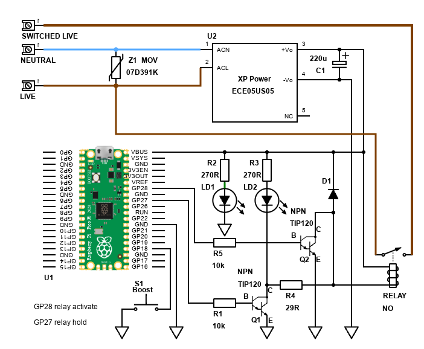

# PiPicoW_CMongoose_HotWaterTimer
Hot Water Timer using C and Mongoose Web Server

Using a Raspberry Pi Pico, control an electric immersion tank via a web page.

Now using C++ and Mongoose Web Server.

Based on Dr Jon EA examples and libraries:

https://www.youtube.com/@drjonea
https://github.com/jondurrant/RPIPicoWExp-Mongoose/
https://github.com/jondurrant/RPIPicoOnboardNVS/
https://github.com/jondurrant/RPIPicoFlashExp/

Replaces micropython version (see https://github.com/electro-dan/PiPicoWHotWaterTimer).

To clone, assuming you put projects in a 'GIT' subfolder inside home:

    cd ~/GIT
    git clone --recurse-submodules https://github.com/electro-dan/PiPicoW_CMongoose_HotWaterTimer

Linux Ubuntu/Debian users dependencies:

    sudo apt install cmake python3 build-essential gcc-arm-none-eabi libnewlib-arm-none-eabi libstdc++-arm-none-eabi-newlib libusb-1.0-0-dev

You also need pico-sdk and picotool.

    cd ~/GIT
    git clone https://github.com/raspberrypi/pico-sdk
    cd pico-sdk
    git submodule update --init
    
    cd ~/GIT
    git clone https://github.com/raspberrypi/picotool
    cd picotool
    export PICO_SDK_PATH=~/GIT/pico-sdk
    cmake .
    make -j 4
    sudo make install

Linux Ubuntu / Debian users fix to not require sudo for programming every time:

    cd ~/GIT/picotool
    sudo cp udev/60-picotool.rules /etc/udev/rules.d/
    sudo udevadm control --reload-rules && sudo udevadm trigger

Change mongoose to specific tag as master may be unstable

    cd ~/GIT/PiPicoW_CMongoose_HotWaterTimer/lib/mongoose/
    git fetch
    git checkout 7.20

For first time file after clone or update mongoose, pack needs to be built:
    
    cd ~/GIT/PiPicoW_CMongoose_HotWaterTimer/lib/mongoose/test/
    make pack

To build, set variables first:

    export PICO_SDK_PATH=~/GIT/pico-sdk
    export WIFI_SSID=myssid
    export WIFI_PASSWORD=mywifipassword

To build code:

    cd ~/GIT/PiPicoW_CMongoose_HotWaterTimer/build
    mkdir build && cd build
    cmake ..
    make
    make install

Above is for Linux/Mac. Windows would use ninja, for example.

For first time code, hold BOOTSEL button on Pico whilst connecting to USB. Once code if flashed first time, picotool can then force a reboot into bootsel mode without having to hold this button each time.

Forcing a complete rebuild if cmake / make complains, from inside build (cd ~/GIT/PiPicoW_CMongoose_HeatingControl/build):

    cd ~/GIT/PiPicoW_CMongoose_HotWaterTimer/build
    cd .. && rm -r build && mkdir build && cd build

To build the file system:

    cd ~/GIT/PiPicoW_CMongoose_HotWaterTimer
    lib/mongoose/test/pack web/* > src/fs.c
    cd ~/GIT/PiPicoW_CMongoose_HotWaterTimer/build
    make
    make install

To see messages via USB serial (via MG_INFO), Linux users can use minicom. Ubuntu or derivatives should add their user to dialout if not already done:

    sudo adduser $USER dialout
    sudo apt install minicom
    
    minicom -b 115200 -o -D /dev/ttyACM0

Schematic:

